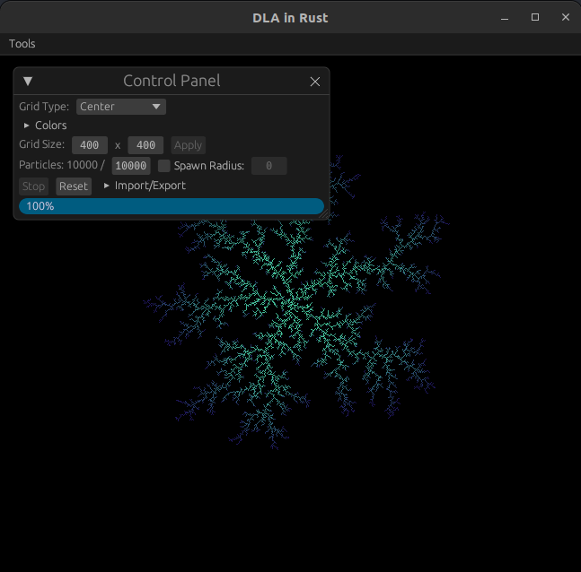

<h1 align=center>
Diffusion Limited Aggregation in Rust
</h1>

# What is it?
A live, configurable, simulator of [Diffusion Limited Aggregation](https://en.wikipedia.org/wiki/Diffusion-limited_aggregation) (DLA). DLA is the clustering of particles undergoing a random walk due to Brownian motion.

The core algorithm is simple:
1. Initialize a 2d/3d space with at least 1 position marked as "filled" (occupied by a particle).
2. Spawn a particle at an "unfilled" position.
3. Simulate a random walk for said particle until it's directly adjacent (touching) an existing particle, at which point it will "stick" and "fill" its current position in the space.
4. Repeat steps 2 and 3 until you've reached a desired number of particles, or the grid is full (and executing step 2 is no longer possible).

In this simulator, DLA is modeled on a 2d space in [Rust](https://github.com/rust-lang/rust) using a [Pixels](https://github.com/parasyte/pixels) frame buffer and [egui](https://github.com/emilk/egui) GUI.

# How To Run
Visit [benliepert.github.io](https://benliepert.github.io) for a version (generated with [run-wasm](https://github.com/rukai/cargo-run-wasm)) that runs in your browser.\
Or you can build and run the standalone app by using `cargo run` at the root of this repo.

## Acknowledgments
Thanks [@parasyte](https://github.com/parasyte) for your [Conway's Game of Life](https://github.com/parasyte/pixels/tree/main/examples/conway), [Minimal Egui](https://github.com/parasyte/pixels/tree/main/examples/minimal-egui), and [Minimal Web](https://github.com/parasyte/pixels/tree/main/examples/minimal-web) examples!
